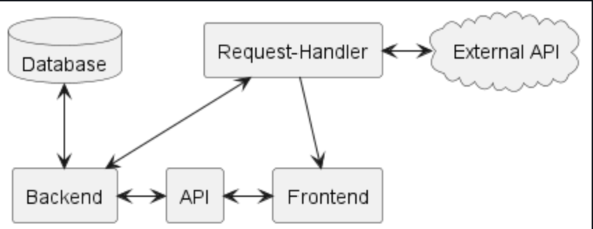

= Noteneinschätzung ITP
Stevan Vlajic
1.0.0, {docdate}: ITP
//:toc-placement!:  // prevents thee generation of the doc at this position, so it can be printed afterwards
:sourcedir: ../src/main/java
:icons: font
:sectnums:    // Nummerierung der Überschriften / section numbering
:toc: left
:experimental:

//Need this blank line after ifdef, don't know why...

// print the toc here (not at the default position)
//toc::[]

== ITP-THEORIE

* Derzeitiger Notenstand: 2-3
* Persönliche Einschätzung: 2

* Wieso die bessere Note?
** IOT-Teilnahme
** Erledigte Docker-Hausübungen 
*** Dockerfile Hausübung
*** Docker-compose Hausübung
* Semesternote 2

== ITP-PROJEKT

* Einiges der Dokumentation von Jahresanfang bis Jahresmitte 

* Tasks und User-Stories erstellt

* Um was habe ich mich gekümmert?
** Frontend-Wireframes mittels typescript & java-script & tailwind css implementiert
*** Chart-JS integration mit dummy-data
*** Eigenst implemetierte dynamische Charts (für die ausgelesenen Werte)
** SIGN-UP-PAGE 
** LOGIN-PAGE 
** CURRENT-DATA PAGE 
** ...

** Gedockertes Front-END
** BASH-script zum ausführen des docker-files

* Python csv-data-generator (mock-data-generator) selbst implementiert, um die sich ändernden Werte der PV-Anlage zu simulieren. 

** Wieso: 
*** 
*** Die Arbeit wird aufgeteilt, damit das Back-End-Team nicht auf das Request-Handler-Team warten muss. Die Bereiche Request-Handler und Backend können isoliert von einander arbeiten. Eine schnellere Arbeit und unblockierte Arbeit wird gewährleistet.

** Vorgehensweise: Data-generator läuft in einer Loop und generiert Daten mit stetigen Pausen von 3s. Daten werden vom Rest-Api-/Backend-team ausgelesen und per HTTP-Routen zur Verfügung gestellt. 

* Bei den Tests, Model und Repos mitgeholfen über Discord. 

=== TEAM-RESÜMEE
* Das Team-Resumee ist unter: https://github.com/2223-3ahitm-itp/2223-3ahitm-project-stromverbrauchsvisualisierung/blob/docu/asciidocs/zusammenfassung/activity-summary.adoc[Resumee] einsehbar

== LINKS
* Grundsätzlich ist das vollständige Projekt auf dem dev-branch zu finden

* SCRUM-commit-ids & Links:
** https://vm81.htl-leonding.ac.at/issue/23strom-10/Create-Frontend[Create Frontend]
** https://vm81.htl-leonding.ac.at/issue/23strom-21/Implement-Home-Page-Wireframe[Wireframe implementation]
** https://vm81.htl-leonding.ac.at/issue/23strom-44/Docker-Frontend[Dockerize Frontend]
** https://vm81.htl-leonding.ac.at/issue/23strom-38/Create-Generator[Python-Dummy-Data-Generator]

== HOW TO START THE FRONT-END
* Grundsätzlich sind die HowTo's unter:
** https://github.com/2223-3ahitm-itp/2223-3ahitm-project-stromverbrauchsvisualisierung/blob/dev/README.adoc[README.adoc]

* `bash ./run-docker.sh`
* localhost:3000 auf dem Web-browser aufrufen oder einfach `curl http://localhost:3000` ausführen

== HOW TO START THE BACK-END
* Der Datengenerator: https://github.com/2223-3ahitm-itp/2223-3ahitm-project-stromverbrauchsvisualisierung/tree/rest-api/Visualisierung/data-generator[Datengenerator]
* Starten mit: `python data-generator.py`