= Prozessmanagement
Stevan Vlajic
1.0.0, {docdate}: MySQL & Maria-DB
//:toc-placement!: // prevents the generation of the doc at this position, so it can be printed afterwards
:sourcedir: ../src/main/java
:icons: font
:sectnums:  // Nummerierung der Überschriften / section numbering
:toc: left

//toc::[]

== Prozesszustände in Linux

=== Suchen und starten Sie einen Prozess, der relativ lange oder permanent läuft, z.B.:

* Download eines sehr großen Files mit wget

Beispiel:  Download mit Linux Mint download

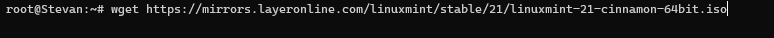

* Anzeige in top

Prozess wget läuft...

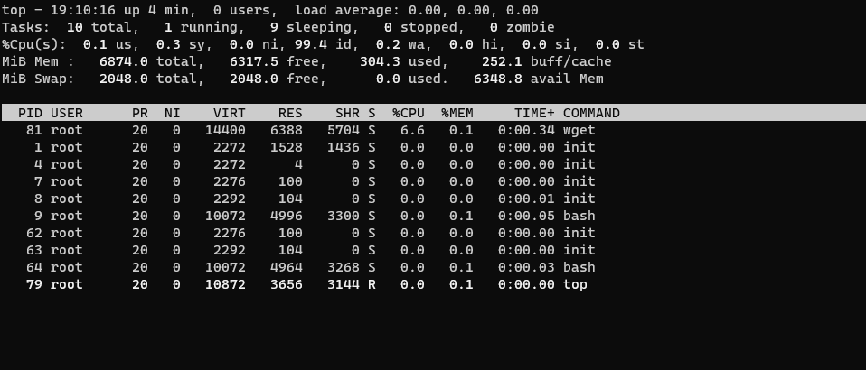

== Starten Sie eine zweite Shell und analysieren Sie die laufenden Prozesse und deren Zustände in Ihrem System

* ps -aux | grep nano

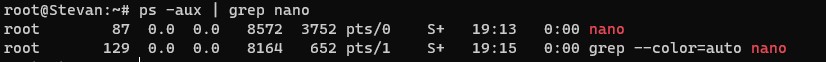

* pstree

wget-Prozess wird angezeigt

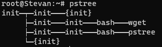

* top

== Halten Sie den langen/permanenten Prozess an und analysieren Sie, welchen Prozesszustand er jetzt aufweist

* Der Prozess wird mit STRG+Z angehalten

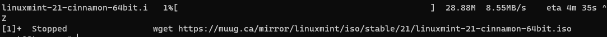

* Verhalten bei angehaltenem Prozess

Unter *[wget]* kann man sehen, dass der Prozess wirklich angehalten wurde. Die Laufzeit wurde gestoppt.

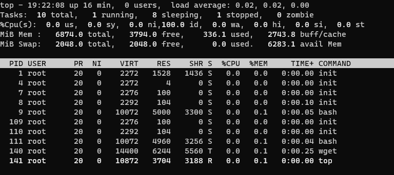

== Schicken Sie den Prozess in den Hintergrund. Welcher Prozesszustand wird jetzt angezeigt?

* Ein Prozess kann mit *[bg wget ...]* in den Hintergrund geschickt werden

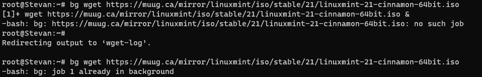

* Ein Prozess wird mit *[&]* sofort in den Hintergrund geschickt:

`wget -nv http://download.example.org/linux_image_1.iso &`

Prozesse, die im Hintergrund laufen benutzen, immer noch die Standard-ein und Ausgabe der Shell.

Prozesse im Hintergrund laufen zu lassen ist nur sinnvoll, wenn der Prozess lange braucht(Downloads,...).

* Ansicht in der top

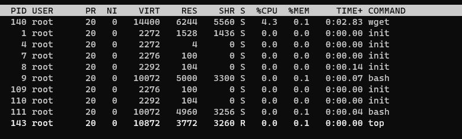

* jobs

Mit dem Command *[jobs]* lassen sich die derzeitig laufenden Prozesse nachvollziehen

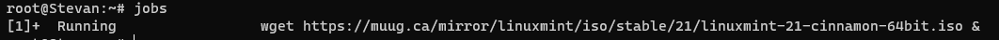

=== Prozesse automatisch in den Vordergrund oder Hintergrund schicken

* Vordergrund
** `fg %id`

* Hintergrund
** `bg %id`

== Holen Sie Ihren Prozess wieder in den Vordergrund und schließen Sie den Prozess in der Shell.

Prozess wird in den Vordergrund geschoben

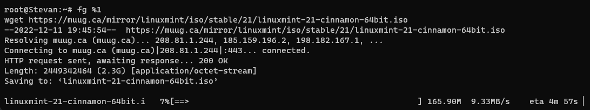

== Diskutieren und begründen Sie, warum ein nicht angehaltener Prozess nicht immer den Status running hat.

Da ein anderer Prozess[B] eine höhere Priorität als der Prozess[A] hat. Der Prozess[B] wird abgearbeitet, danach bekommt Prozess[A] den Status running.

== Tool YES

`yes y`

Prozessorauslastung & Zustände

* Ohne Umleitung

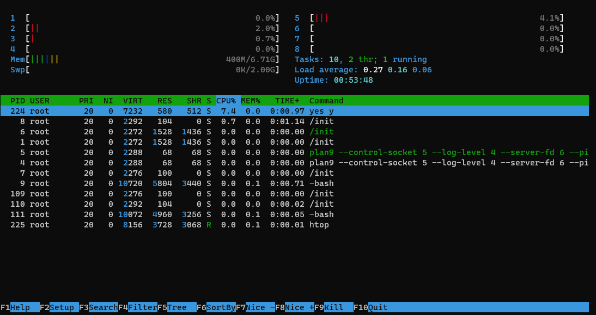

* Mit Umleitung

Der 4te Prozessorkern wird extremst belastet

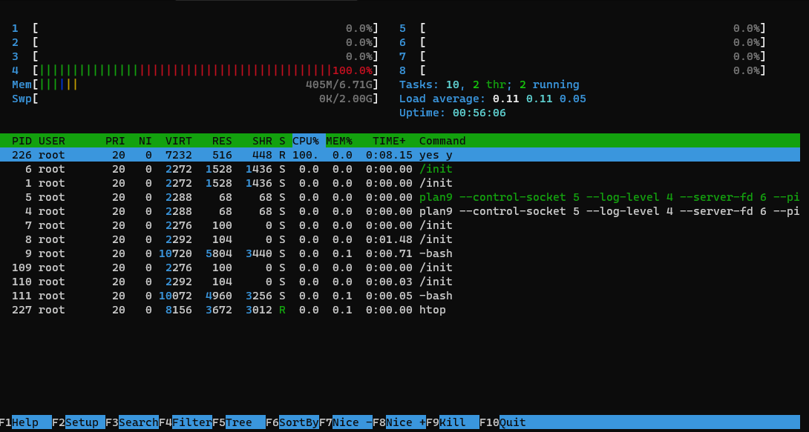

Die Prozessorauslastung ist so hoch da das dev-Verzeichnis ein besonderes ist. Das Verzeichnis /dev/ besteht aus Dateien, die Geräte darstellen, die an das lokale System angeschlossen sind.

Das /dev/null "Verzeichnis" ist eine Art Vakuum, welches alle Schreibvorgänge verwirft, also zu 0 bytes macht.

`dd > /dev/null`
500MB werden auf vom Prozessor auf 0 Bytes geschrieben

Der Prozessor wird dementsprechend durch das dauerhafte umleiten und verwerfen überfordert, da zwei Prozesse unheimlich schnell aufeinander treffen.

== Recherchieren Sie den Unterschied zwischen einer Prozesspriorität und einem NiceLevel in Linux.

Der Nice-wert gibt die Prozesspriorität an.

EinProzess ist dann "nice", wenn dieser weniger Rechenzeit verbraucht und anderen Prozessen mehr Rechenzeit lässt.

Prozesse ohne spezielle Handhabung haben eine normale Priorität, das heißt sie haben einen nice-wert von 0.

* Die Nice-Priorität kann beim Start vom Prozess mit verändert werden:

`nice -15 foo`

Je höher der nice-wert, desto höher die Priorität

* Mit dem Tool re-nice oder mit top lassen sich Prozessprioritäten während des Laufens verändern

`sudo renice nice-value pid`

`sudo renice 6 3244`

* Praktisches Beispiel für Prozesspriorisierung

*Beispiel:*

Man besitzt einen Leistungsschwachen PC und muss eine schwierige Primzahl berechnung in 2h fertig bekommen. Nebenbei möchte man sich aber ein Video herunterladen. Das Herunterladen des Videos hat aber eine höhere Prozesspriorität, daher bleibt weniger Leistung für die Berechnung übrig.

Hierbei kann man das Tool renice verwenden, um die Priorisierung zu ändern. Nun wird hat das Berechnen eine höhere priorität und wird zuerst bearbeitet.

== Windows: Analyse Kontextwechsel

