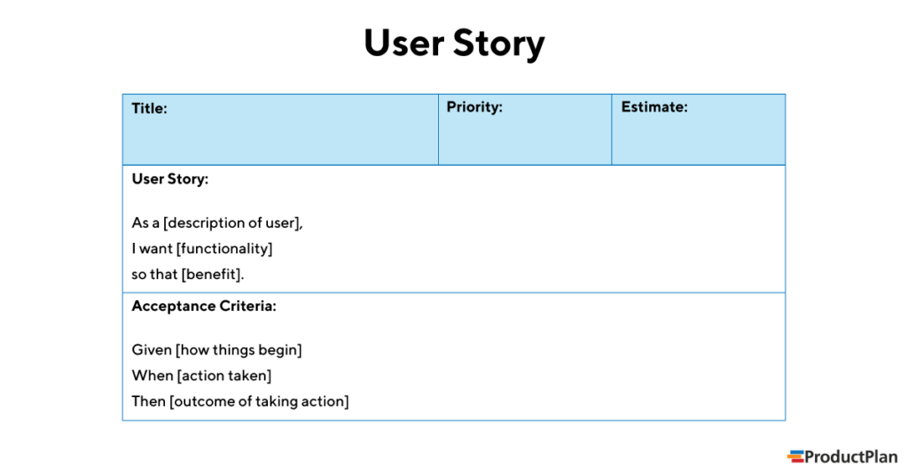

= ITP 2023/24
Stevan Vlajic
1.0.0, {docdate}:
//:toc-placement!:  // prevents the generation of the doc at this position, so it can be printed afterwards
:sourcedir: ../src/main/java
:icons: font
:sectnums:    // Nummerierung der Überschriften / section numbering
:toc: left
:experimental:

//Need this blank line after ifdef, don't know why...

// print the toc here (not at the default position)
//toc::[]

== 19.09.2023

* Scrum Vorgehensweise
image:./img/scrum.png[]

== 26.09.2023
* Wie schreibt man eine User-Story

== 04.10.2023
* Was sind GH-Actions:
** Mit GH-Actions kann eingetragen werden was nach dem Push passiert wie z.B.:
*** Code wird getestet
*** Code wird auf eigener GH-Instanz ausgeführt
*** GH-Actions lassen sich konfigurieren

* Wo befinden sich GH-Actions:
** `.github/workflows/build.yaml`

[code, YAML]
----
name: Java HelloWorld action
run-name: ${{ github.actor }} has tested helloWorld in java
on: [push]
jobs:
  hello-world:
    runs-on: ubuntu-latest
    steps:
      - uses: actions/checkout@v3
      - uses: actions/setup-java@v3
        with:
          distribution: 'temurin'
          java-version: '17'
          check-latest: true
      - run: javac HelloWorld.java
      - run: java HelloWorld
----

* Was passiert oben:
** `name`: Name für die Action wird vergeben
** `run-name`: Name für eine Ausführung wird vergeben
** `on`: Zu welchem Zeitpunkt wird gepusht
** `jobs`: Die einzelnen Instanzen werden definiert, welche ausgeführt werden sollen
** `runs-on`: OS wird ausgewählt zum Starten
** `steps`: Einzelne BASH-command werden in den steps ausgeführt
** `uses`: Holt sich Repository um gewisse Umgebung einrichten zu können
** `with`: Weitere konfigurationen für verschiedene Aktionen werden festgelegt
** `run`: Führt BASH command aus

* Wo ist die Action zu finden:
** Wird der code gepusht wird eine neue Instanz auf GitHub hochgefahren
** Beispiel: https://github.com/Stevan06v/java-gh-actions-assignment/actions

== 10.10.2023

* https://docs.github.com/de/actions/using-workflows/storing-workflow-data-as-artifacts
** Artefakte sind Sachen mit denen man baut -> jar-files

* Git Tagging:
** https://calver.org/
** `git tag -a 241010.01 -m "erste version für release"`
** `git tag`
** `git push origin 241010.01`
** Upload releases to github:
*** https://github.com/marketplace/actions/upload-to-github-release

