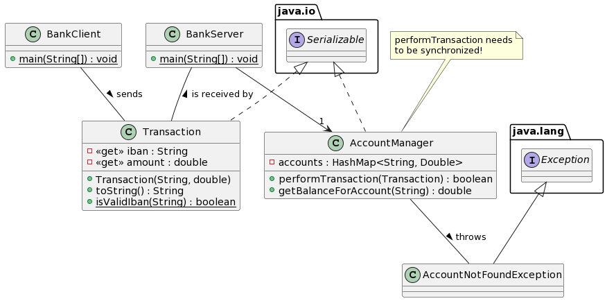

# PROO 3 - Assignment: _Socket Banking_
## Objective
Get familiar with _Sockets_ in Java by implementing a simple _client-server_-application for performing bank transactions.

## Things To Learn

* Working with `Socket`s and _Streams_.
* _Serializing_ objects.
* Working with `Thread`s and synchronization.

## Submission Guidelines
* Your implemented solution as **_zipped_** _IntelliJ_-project.

## Task


In this assignment you'll create a simple, text-based application for very rudimentary _online banking_. Start by preparing the following classes:

* A `Transaction` is represented by an _International Bank Account Number_ (_IBAN_) and the transaction amount. Both properties are read-only.
    * An `IllegalArgumentException` is to be thrown, if the _IBAN_ is invalid. Use the static _helper_ method `isValidIban` for this - the validation algorithm is described in the _Hints_ section.
    * Make sure the class is _serializable_ so we can pass it using _streams_.
* The `AccountManager` stores all bank accounts - the most minimalistic solution is a _map_ of `String` (i.e. _IBAN_) to `Double` (i.e. the balance) values, but you are free to use whatever you like.
    * _Transactions_ can be performed using the `performTransaction` method.
        * If the _IBAN_ does not exist, a new account with the respective balance is created.
        * Overdrafts are not possible - return `false` if a transaction would lead to a negative belance.
        * Make sure that the method is `synchronized` and think of reasons why this is necessary in the context of a _multi-threaded server_.
    * The balance of an account can be retrieved using `getBalanceForAccount`. If the passed _IBAN_ does not exist, a (_checked_) `AccountNotFoundException` is to be thrown.
    * The `AccountManager` should be serializable as well for _persistence_ reasons.

 Next, prepare a _main_ class for the _server_:

 * The `BankServer` should listen and accept incoming connections on the _port_ `7070` using a `ServerSocket` (of course).
    * Bonus: Create an own _thread_ when accepting a connection to enable multiple clients at once.
* Since your server will be receiving serialized objects you should use an `ObjectInputStream`, as well as a `PrintWriter` for text-based answers to the connected client.
    * Make sure to use `try-with-resources`-statements as shown in the _demos_! 
* The accounts are stored in an `AccountManager` object.
    * Bonus: Use _serialization_ to make sure the accounts are persisted when stopping and starting the server.

Finally, you can create the _client_:

* After asking the user for an _IBAN_ (until a valid one is entered!) the client should connect to the server and allow multiple amounts to be transferred until the input `quit`.
* Since your client will be sending serialized objects you should use an `ObjectOutputStream`, as well as a `BufferedReader` for text-based answers from the server.

You can use the following exemplary outputs to guide you through the implementation:

### Exemplary Client Output

```
Please enter your IBAN: AT022050302101023600
Valid IBAN entered.
Enter amount for new transaction (or "quit" to quit the application): 10.0
Response from server: Transaction successful. New balance: 10.00.
Enter amount for new transaction (or "quit" to quit the application): haxi
Number not formatted correctly.
Enter amount for new transaction (or "quit" to quit the application): 5.0
Response from server: Transaction successful. New balance: 15.00.
Enter amount for new transaction (or "quit" to quit the application): -10.0
Response from server: Transaction successful. New balance: 5.00.
Enter amount for new transaction (or "quit" to quit the application): -10.0
Response from server: Transaction unsuccessful.
Enter amount for new transaction (or "quit" to quit the application): 2
Response from server: Transaction successful. New balance: 7.00.
Enter amount for new transaction (or "quit" to quit the application): quit
```

### Exemplary Server Output
N.B.: The server output is not really necessary but proves useful for debugging purposes.

```
SERVER: Starting.
SERVER: Listening for a connection.
SERVER: Connection accepted.
SERVER: Listening for a connection.
SERVER-THREAD: Starting.
SERVER-THREAD: Received object "AT022050302101023600: 10.00,-".
SERVER-THREAD: Received object "AT022050302101023600: 5.00,-".
SERVER-THREAD: Received object "AT022050302101023600: -10.00,-".
SERVER-THREAD: Received object "AT022050302101023600: -10.00,-".
SERVER-THREAD: Received object "AT022050302101023600: 2.00,-".
SERVER-THREAD: Received null. Finishing.
SERVER-THREAD: Finished.
```

## Hints
### Validating _IBANs_
From _Wikipedia_:

>An IBAN is validated by converting it into an integer and performing a basic mod-97 operation (as described in ISO 7064) on it. If the IBAN is valid, the remainder equals 1. The algorithm of IBAN validation is as follows:
>1. Move the four initial characters to the end of the string
>2. Replace each letter in the string with two digits, thereby expanding the string, where A = 10, B = 11, ..., Z = 35
>3. Interpret the string as a decimal integer and compute the remainder of that number on division by 97
If the remainder is 1, the check digit test is passed and the IBAN might be valid.

Example (also from _Wikipedia_):

>* IBAN:		GB82 WEST 1234 5698 7654 32	

>* Rearrange:		W E S T12345698765432 G B82

>* Convert to integer:		3214282912345698765432161182

>* Compute remainder:		3214282912345698765432161182	mod 97 = 1

Since you will be dealing with potentially very large numbers you could use the `BigInteger`-class for accomplishing this easily. The _constructor_ accepts a `String` and there is also a `mod`-method.