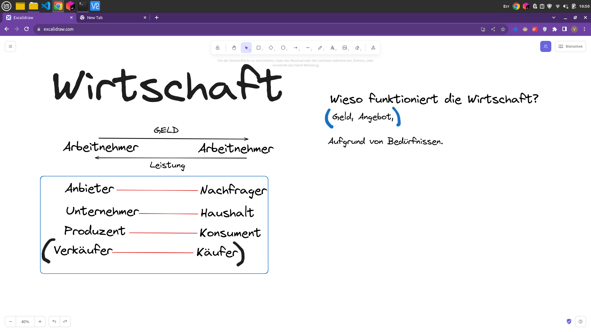
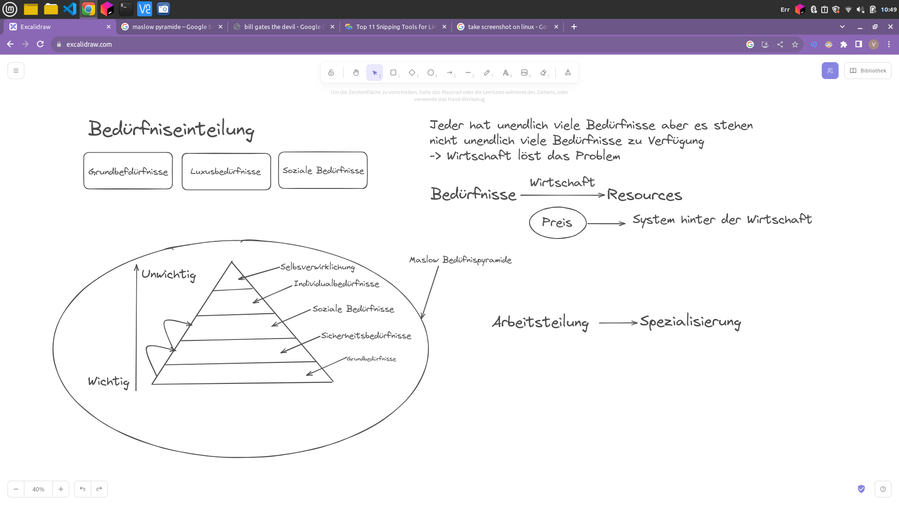
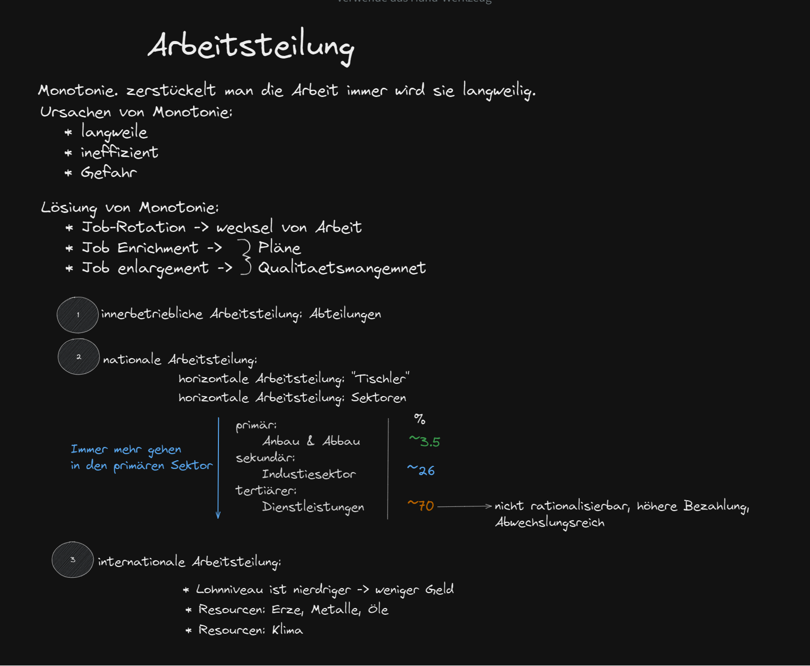
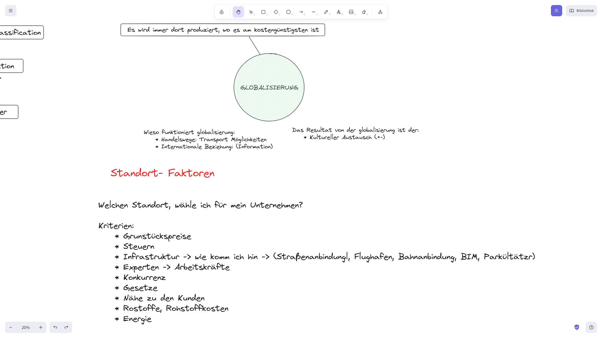
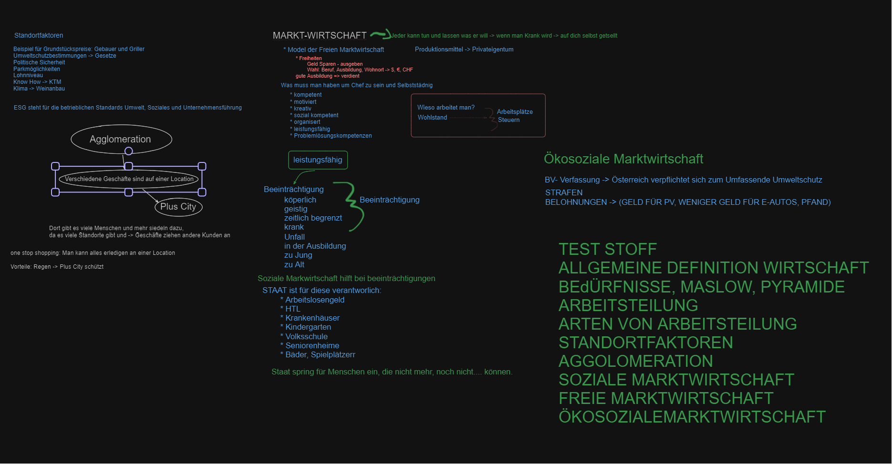
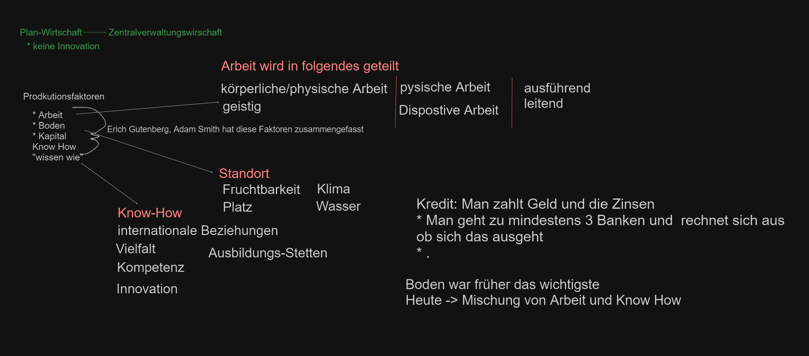
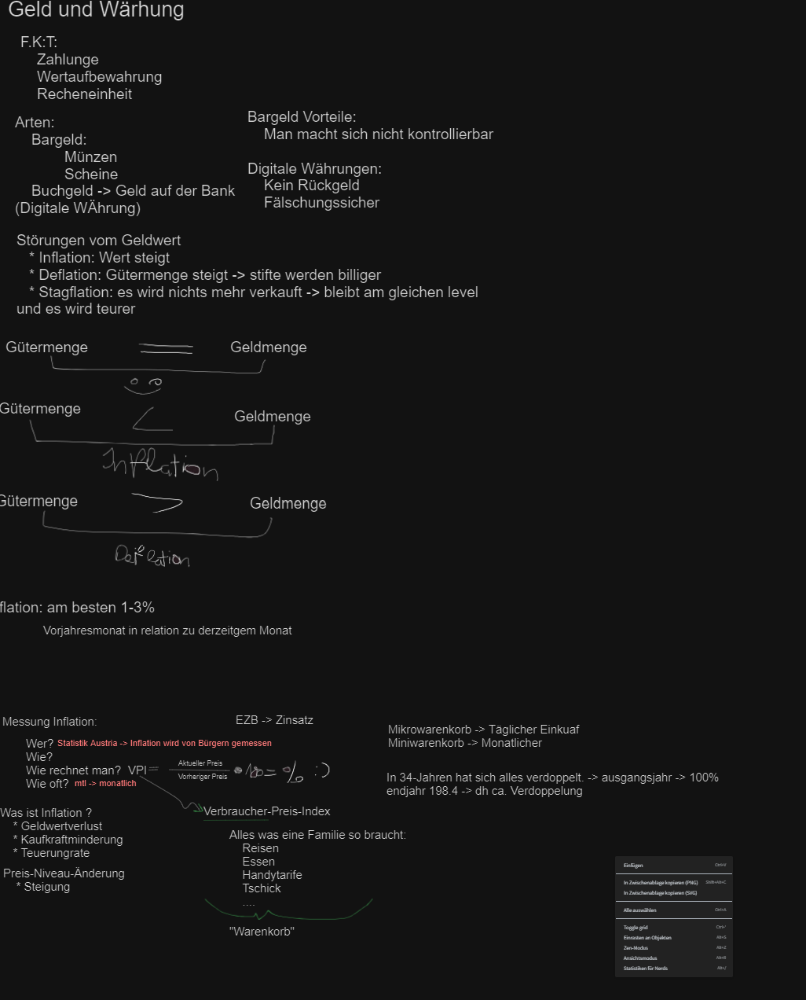
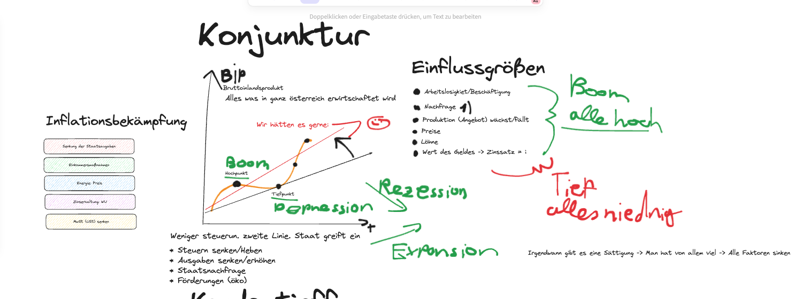
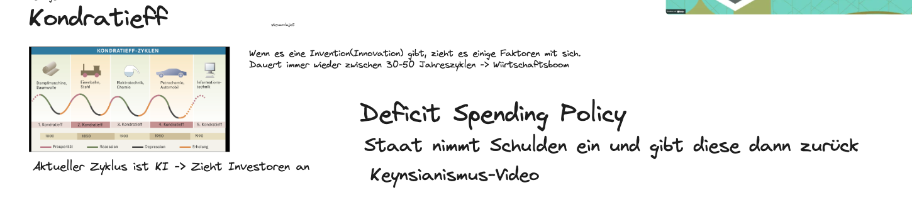
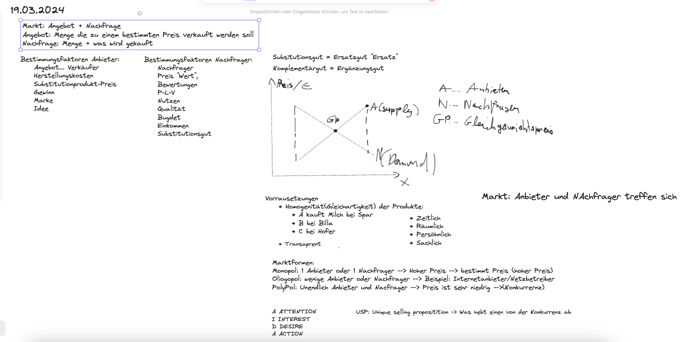

= Wirtschaft Mitschrift
Stevan Vlajic
1.0.0, {docdate}: 
//:toc-placement!:  // prevents the generation of the doc at this position, so it can be printed afterwards
:sourcedir: ../src/main/java
:icons: font
:sectnums:    // Nummerierung der Überschriften / section numbering
:toc: left
:experimental:

//Need this blank line after ifdef, don't know why...

// print the toc here (not at the default position)
//toc::[]

== 19-09-2023

== 26-09-2023

== 03-10-2023

== 03-10-2023

== 03-10-2023

== TEST 2 

=== ARBEIT

=== GELD-WÄHRUNG

=== KONJUNKTUR

=== KONTRADIEFF

=== Markt
